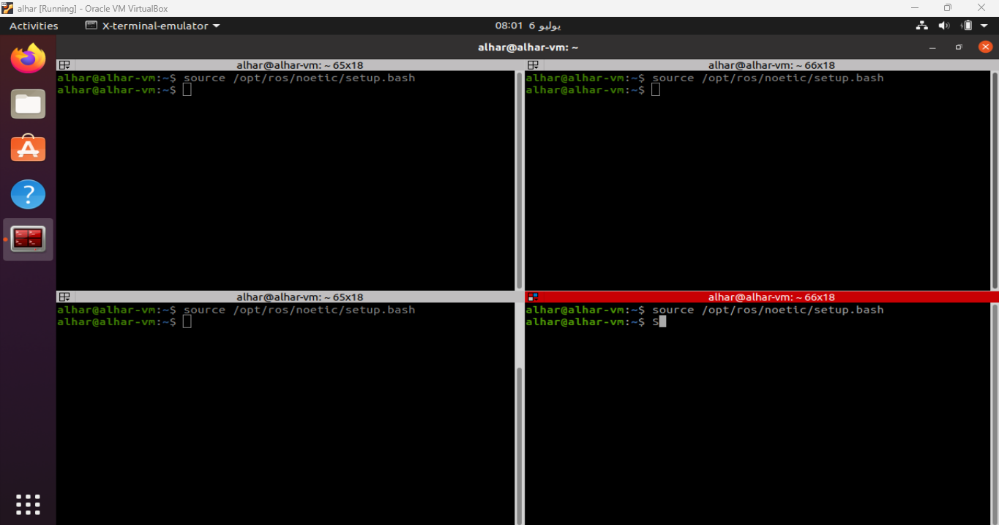
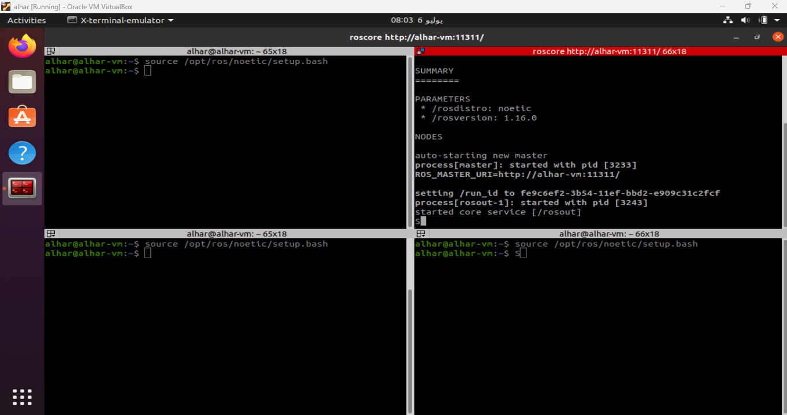
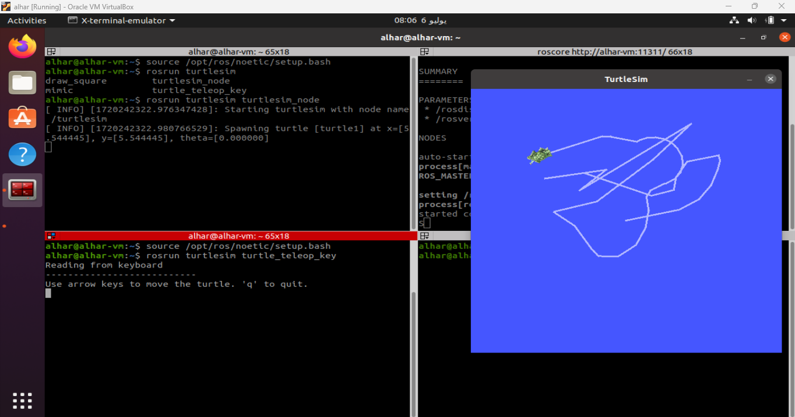

# turtlesim-package

In this repo, I will play with the turtlesim package in ROS Noetic.

1. Source the ROS environment in the terminal

   
2. Run the master using the command `roscore`

   
3. Run the turtlesim turtlesim_node and turtle_teleop_key,

   usign the command `rosrun turtlesim turtlesim_node` for the graphical user interface

   and `rosrun turtlesim turtle_teleop_key` to control the turtle using the keyboard

   
